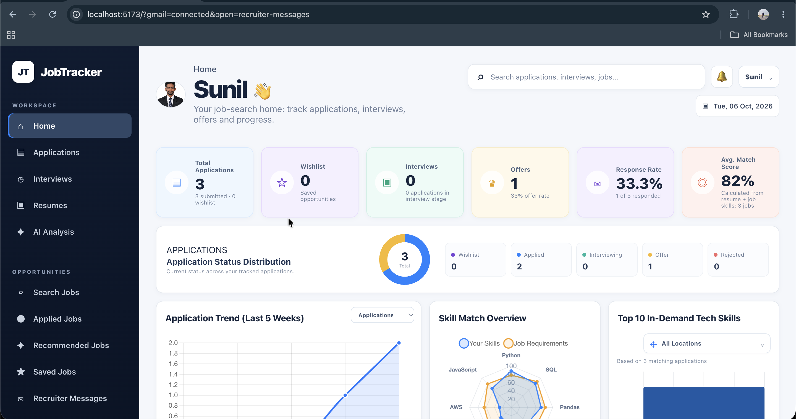
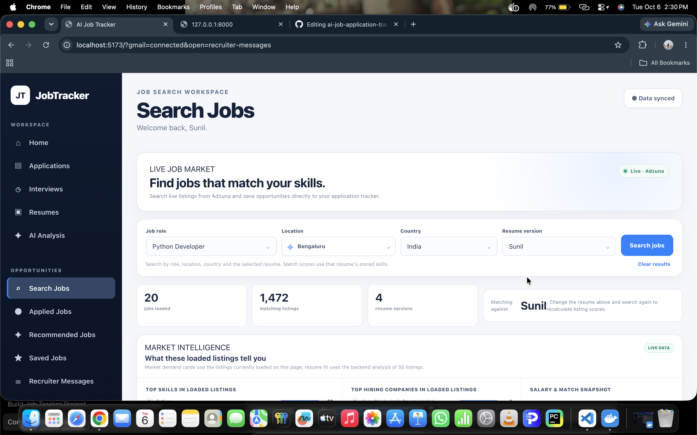
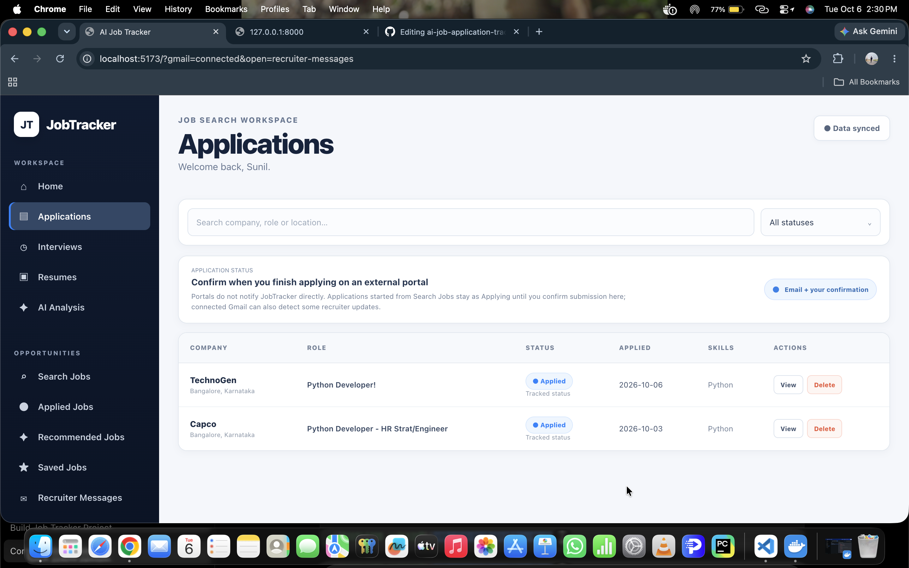
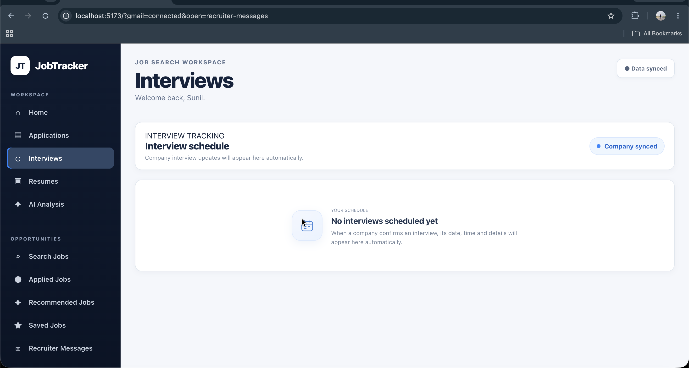
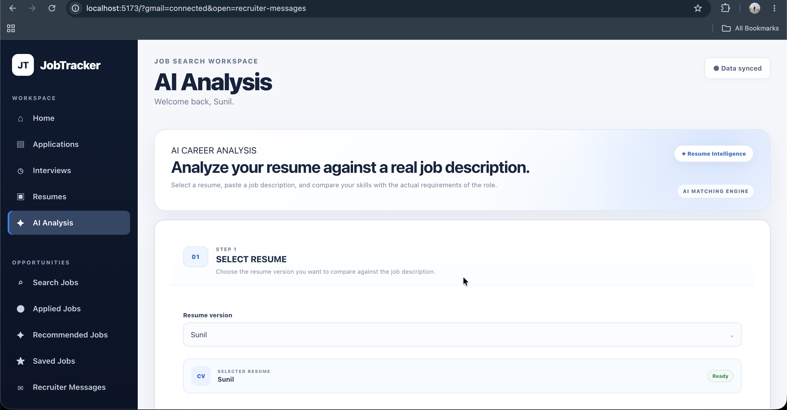
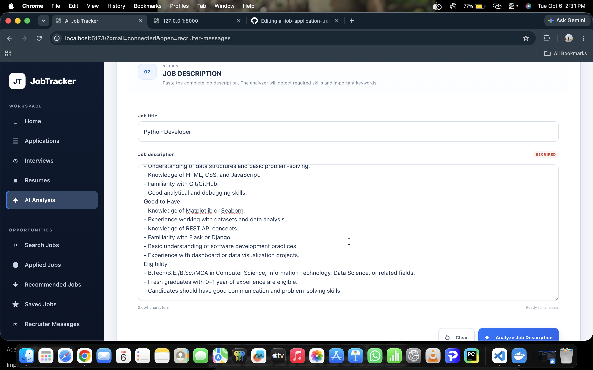
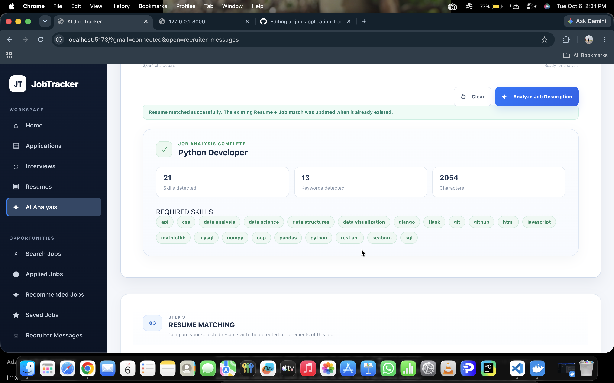
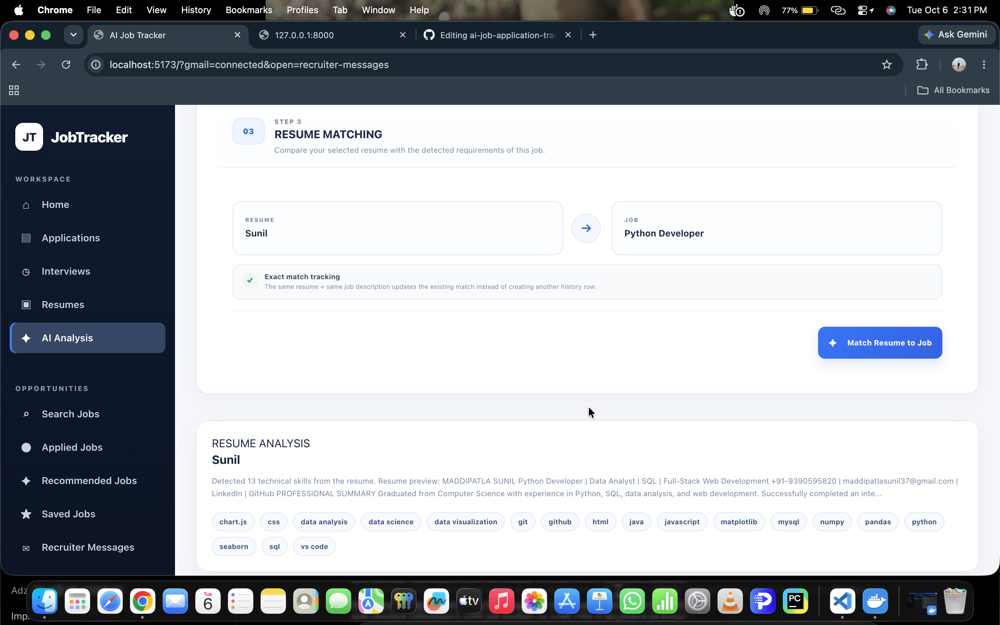
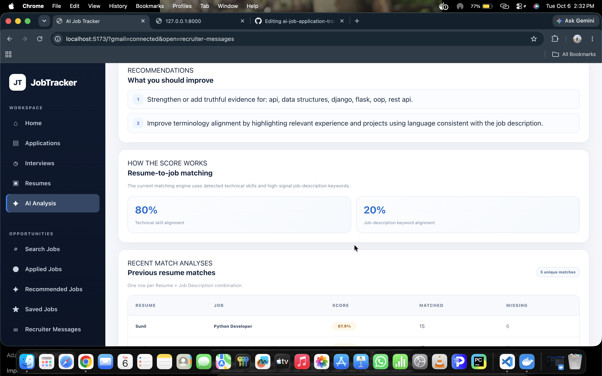

# AI Job Tracker

> An AI-powered job search and application management platform for
> organizing job opportunities, tracking applications, managing resumes,
> analyzing resume-to-job compatibility, preparing for interviews, and
> monitoring recruiter communication from one workspace.



## Overview

AI Job Tracker is a full-stack web application designed to bring the
complete job-search workflow into one focused workspace.

Instead of managing job applications across spreadsheets, notes, email
threads, and separate tools, the platform provides a central place to:

-   Discover and search for jobs
-   Save and track job applications
-   Manage application statuses
-   Upload and manage resume versions
-   Compare a resume with a real job description
-   Identify matched and missing skills
-   Review AI-generated resume recommendations
-   Manage interviews and preparation notes
-   Connect recruiter communication through Gmail
-   Monitor job-search activity from a dashboard

The application is built with a React frontend and a Python/FastAPI
backend, with PostgreSQL used for application data.

------------------------------------------------------------------------

## ✨ Key Features

### 🔎 Job Search

Search for relevant opportunities using role, location, and other
job-search criteria.

The workflow is designed around the real application journey rather than
treating a saved job as an application.

**Application lifecycle:**

``` text
Wishlist
   ↓
Applying
   ↓
Applied
   ↓
Screening
   ↓
Interview
   ↓
Offer

Alternative outcomes:
Rejected / Withdrawn
```

------------------------------------------------------------------------

### 📋 Application Tracking

Keep job opportunities organized in one place.

Application records can contain information such as:

-   Company
-   Role
-   Location
-   Job URL
-   Source
-   Application status
-   Salary
-   Notes
-   Required skills
-   Resume version

The application status model supports:

``` text
Wishlist
Applying
Applied
Screening
Interview
Offer
Rejected
Withdrawn
```

------------------------------------------------------------------------

### 📄 Resume Management

Upload and manage resume versions from the Resumes section.

Supported resume formats include:

-   PDF
-   DOC
-   DOCX

Resume versions can be used as the input for AI-based resume analysis
and job matching.

------------------------------------------------------------------------

### 🤖 AI Resume & Job Analysis

The AI Analysis workspace allows a user to select a resume and paste a
job description.

The workflow analyzes the job description and then compares it with the
selected resume.

It provides information such as:

-   Resume/job match score
-   Matched skills
-   Missing skills
-   Job-description keywords
-   Recommendations
-   Detected job requirements
-   Recent match history

The matching system uses technical skill alignment and job-description
keyword alignment to calculate the match score.

------------------------------------------------------------------------

### 🎯 Resume Improvement Workflow

The project includes an AI Resume Improvement workflow designed around a
job-specific resume rather than blindly rewriting the original resume.

The intended improvement flow is:

1.  Rewrite the professional summary
2.  Improve existing project and experience bullets
3.  Identify missing skills separately
4.  Avoid claiming skills or experience that are not actually present
5.  Create a job-specific resume version

The original resume should remain separate from any improved version.

------------------------------------------------------------------------

### 🗓 Interview Management

Track interviews associated with applications and keep preparation
information organized.

Interview preparation includes areas such as:

-   Interview details
-   Preparation notes
-   STAR stories
-   Questions to ask the interviewer
-   Technical or project topics to revise
-   Interview-stage information

The application process can progress from application submission through
interview rounds and eventually to an offer or other outcome.

------------------------------------------------------------------------

### 📧 Recruiter Messages & Gmail Integration

The project includes recruiter-message integration designed to connect
Gmail communication with application tracking.

Relevant recruiter/application messages can be classified using signals
such as:

``` text
Application received
Application under review
Interview invitation
Offer letter
Rejection / not moving forward
```

The goal is to reduce manual status updates while keeping the
application record synchronized with recruiter communication.

> Gmail/OAuth configuration requires environment variables and Google
> Cloud configuration. Never commit real OAuth secrets or `.env` files
> to GitHub.

------------------------------------------------------------------------

### 📊 Dashboard

The dashboard provides a centralized view of job-search activity and
helps users understand their current application pipeline.

The application also supports synchronized refresh behavior so job and
interview information can be refreshed when data changes or when the
application regains focus.

------------------------------------------------------------------------

## 🖥️ Screenshots

### Dashboard


The dashboard provides the main workspace for monitoring job-search
activity.

### Job Search



Search and discover opportunities using the job-search workspace.

### Applications



Manage tracked applications and follow their current status.

### Interviews



Review interviews and prepare for upcoming rounds.

### AI Resume Analysis



Select a resume and analyze it against a real job description.

### AI Analysis --- Additional Views









------------------------------------------------------------------------

## 🏗️ Application Architecture

``` text
┌──────────────────────────────────────────────┐
│                 React Frontend               │
│                                              │
│ Dashboard │ Jobs │ Applications │ Resumes   │
│ AI Analysis │ Interviews │ Recruiter Messages│
└──────────────────────┬───────────────────────┘
                       │
                       │ REST API / Axios
                       ▼
┌──────────────────────────────────────────────┐
│                 FastAPI Backend              │
│                                              │
│ Authentication │ Jobs │ Resumes │ Interviews│
│ AI Analysis │ Recruiter Messages             │
└───────────────┬──────────────────┬───────────┘
                │                  │
                ▼                  ▼
       ┌────────────────┐   ┌───────────────┐
       │   PostgreSQL   │   │   Gmail API   │
       │    Database    │   │   Integration │
       └────────────────┘   └───────────────┘
```

------------------------------------------------------------------------

## 🧰 Tech Stack

### Frontend

-   React
-   Vite
-   JavaScript / JSX
-   Axios
-   Chart.js
-   React Chart.js 2
-   CSS

### Backend

-   Python
-   FastAPI
-   SQLAlchemy
-   Pydantic
-   JWT-based authentication
-   Resume document parsing

### Database

-   PostgreSQL

### AI / Resume Analysis

-   Python-based skill extraction
-   Resume parsing
-   Job-description analysis
-   Skill matching
-   Keyword matching
-   Resume recommendations

### Integration & Development

-   Gmail / Google OAuth
-   Docker
-   Git
-   GitHub
-   Visual Studio Code

------------------------------------------------------------------------

## 📁 Project Structure

``` text
ai-job-tracker/
│
├── backend/
│   ├── app/
│   │   ├── routers/
│   │   ├── models/
│   │   ├── schemas/
│   │   └── ...
│   ├── uploads/
│   ├── requirements.txt
│   ├── Dockerfile
│   └── .env.example
│
├── frontend/
│   ├── src/
│   │   ├── App.jsx
│   │   ├── api.js
│   │   ├── main.jsx
│   │   └── styles.css
│   ├── package.json
│   ├── package-lock.json
│   ├── Dockerfile
│   ├── index.html
│   └── vite.config.js
│
├── screenshots/
│   ├── home.png
│   ├── job-search.png
│   ├── applications.png
│   ├── interviews.png
│   ├── ai-analysis-1.png
│   ├── ai-analysis-2.png
│   ├── ai-analysis-3.png
│   ├── ai-analysis-4.png
│   └── ai-analysis-5.png
│
├── docker-compose.yml
├── .gitignore
├── GMAIL_SETUP.md
├── PHASE2.md
├── PHASE3.md
└── README.md
```

------------------------------------------------------------------------

## ⚙️ Run Locally

### Prerequisites

Install the following before running the project:

-   Python 3.x
-   Node.js and npm
-   PostgreSQL
-   Git

Docker can also be used if you prefer a containerized setup.

------------------------------------------------------------------------

## 1. Clone the Repository

``` bash
git clone https://github.com/sc2939459-max/ai-job-tracker.git
cd ai-job-tracker
```

------------------------------------------------------------------------

## 2. Start the Backend

Open a terminal:

``` bash
cd backend
```

Create and activate a virtual environment:

### macOS / Linux

``` bash
python3 -m venv .venv
source .venv/bin/activate
```

Install Python dependencies:

``` bash
pip install -r requirements.txt
```

Configure the backend environment variables using the provided example:

``` bash
cp .env.example .env
```

Update `.env` with your local database and integration configuration.

Start FastAPI:

``` bash
uvicorn app.main:app --reload
```

Backend:

``` text
http://localhost:8000
```

FastAPI documentation:

``` text
http://localhost:8000/api/docs
```

------------------------------------------------------------------------

## 3. Start the Frontend

Open a second terminal:

``` bash
cd frontend
```

Install dependencies:

``` bash
npm install
```

Start the Vite development server:

``` bash
npm run dev
```

Frontend:

``` text
http://localhost:5173
```

------------------------------------------------------------------------

## 🐳 Docker

The repository also contains a `docker-compose.yml` for containerized
development.

``` bash
docker compose up --build
```

To stop the containers:

``` bash
docker compose down
```

Use the Docker configuration in the repository as the source of truth
for the services and environment configuration.

------------------------------------------------------------------------

## 🔐 Environment Variables & Security

Do **not** commit real credentials to GitHub.

Keep sensitive values inside local `.env` files.

Typical protected configuration includes:

``` text
DATABASE_URL
SECRET_KEY
GOOGLE_CLIENT_ID
GOOGLE_CLIENT_SECRET
GOOGLE_REDIRECT_URI
GOOGLE_TOKEN_ENCRYPTION_KEY
FRONTEND_URL
BLOB_READ_WRITE_TOKEN
```

The repository should contain placeholder values in `.env.example`, not
production secrets.

For Vercel deployments, connect a **private Vercel Blob store** and expose
its `BLOB_READ_WRITE_TOKEN` to the backend service. Resume uploads are stored
privately in Blob; local development continues to use `backend/uploads/`.
Resume uploads are limited to 4 MB to stay below Vercel's function request
body limit.

Also keep these out of Git:

``` text
.env
.venv/
node_modules/
backend/uploads/
```

If an OAuth client secret or other credential is ever committed
accidentally, rotate/revoke it immediately in the corresponding provider
console.

------------------------------------------------------------------------

## 🔄 Job Application Workflow

The platform is designed around a complete job-search lifecycle:

``` text
                    ┌──────────────┐
                    │   Job Search │
                    └──────┬───────┘
                           │
                           ▼
                    ┌──────────────┐
                    │   Wishlist   │
                    └──────┬───────┘
                           │
                           ▼
                    ┌──────────────┐
                    │   Applying   │
                    └──────┬───────┘
                           │
                           ▼
                    ┌──────────────┐
                    │    Applied   │
                    └──────┬───────┘
                           │
                           ▼
                    ┌──────────────┐
                    │   Screening  │
                    └──────┬───────┘
                           │
                           ▼
                    ┌──────────────┐
                    │   Interview  │
                    └──────┬───────┘
                           │
                           ▼
                    ┌──────────────┐
                    │     Offer    │
                    └──────────────┘

                 Other outcomes:
               Rejected / Withdrawn
```

------------------------------------------------------------------------

## 🧠 AI Matching Workflow

``` text
Resume
   │
   ▼
Resume Parsing
   │
   ▼
Skill Extraction
   │
   │
   ├───────────────┐
   │               │
   ▼               ▼
Job Description   Keywords
   │               │
   ▼               │
Required Skills    │
   │               │
   └───────┬───────┘
           ▼
     Resume ↔ Job
        Matching
           │
           ▼
      Match Score
           │
     ┌─────┼─────┐
     ▼     ▼     ▼
  Matched Missing Recommendations
  Skills  Skills
```

------------------------------------------------------------------------

## 📌 AI Match History

The AI matching workflow is designed so that the same resume and the
same job description represent one logical match.

When the same combination is analyzed again, the existing match can be
updated instead of continually creating duplicate history entries.

This keeps the Recent Match Analyses view cleaner and more useful.

------------------------------------------------------------------------

## 📚 Documentation

Additional project documentation is available in the repository:

-   `GMAIL_SETUP.md` --- Gmail integration setup
-   `PHASE2.md` --- Phase 2 project documentation
-   `PHASE3.md` --- Phase 3 project documentation

These documents contain development-specific setup and implementation
details.

------------------------------------------------------------------------

## 🧪 Development Notes

This project is actively developed and contains multiple connected
workflows across the frontend and backend.

When making changes:

1.  Keep frontend and backend API contracts synchronized.
2.  Protect authenticated endpoints.
3.  Do not commit secrets.
4.  Test application-status transitions.
5.  Verify resume uploads with supported document types.
6.  Test AI matching with different resume/job combinations.
7.  Verify Gmail OAuth configuration separately from application logic.

------------------------------------------------------------------------

## 🎯 Project Goals

The long-term goal of AI Job Tracker is to provide a single workspace
where a candidate can:

``` text
Discover
   ↓
Evaluate
   ↓
Track
   ↓
Apply
   ↓
Analyze
   ↓
Prepare
   ↓
Interview
   ↓
Receive Outcome
```

The platform combines job tracking, resume intelligence, application
management, interview preparation, and recruiter communication into one
workflow.

------------------------------------------------------------------------

## 👨‍💻 Author

### Sunil Maddipatla

Computer Science graduate focused on:

-   Python
-   SQL
-   Data Analytics
-   Full-Stack Development
-   AI-powered applications

AI Job Tracker was developed as a full-stack project to explore
practical software engineering, data-driven job matching, resume
analysis, application tracking, and third-party API integration.

------------------------------------------------------------------------

## ⭐ Support the Project

If you find AI Job Tracker useful or interesting, consider giving the repository a ⭐ on GitHub.

Feedback, suggestions, and contributions are welcome.

---

## 📄 License

This project is licensed under the MIT License.

See the [LICENSE](./LICENSE) file for the complete license terms.

---

## 👨‍💻 Author

### Sunil Maddipatla

Computer Science graduate interested in:

- Python Development
- Data Analytics
- Software Engineering
- Full-Stack Development
- AI-powered applications

### Technical Skills

Python · SQL · PostgreSQL · Pandas · JavaScript
React · HTML · CSS · FastAPI · SQLAlchemy
Git · GitHub · REST APIs · Data Analysis
